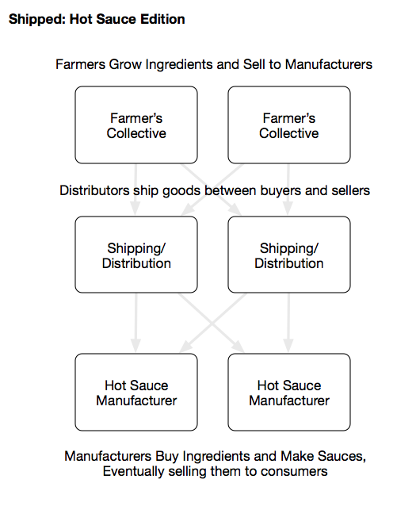
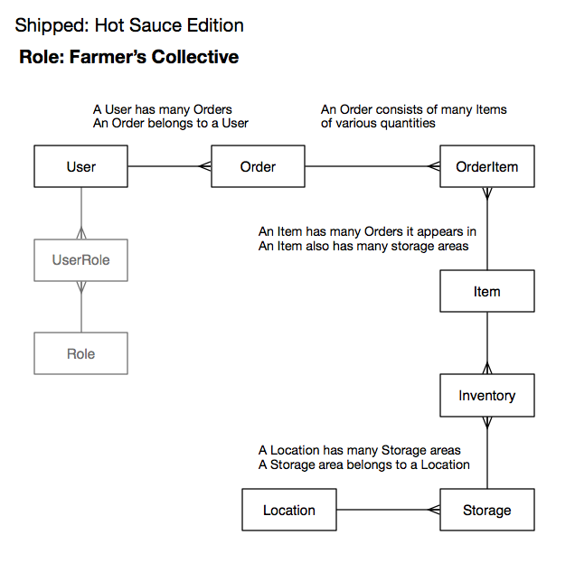
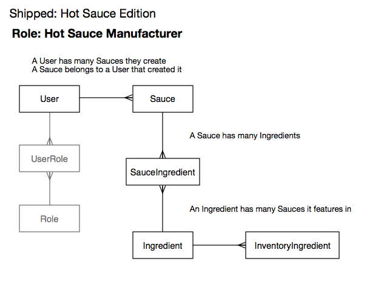
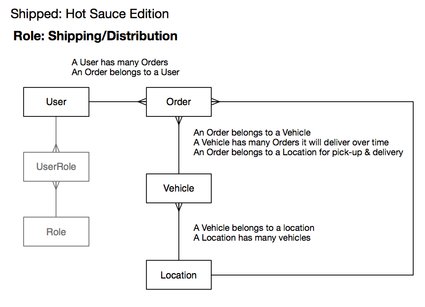

# Pepper Farms

Pepper Farms proudly uses Devise for authentication of our users.

## Getting started with devise

We started our project by creating a new rails application:

`rails new [project_name]`

which in our case was `rails new pepperfarm`

Then we added devise to our Gemfile:

`gem 'devise'`

and ran `bundle install` from the terminal.

Then we ran `rails g devise:install` to set devise up initially.

First we're asked to add a line to our config/environments/development.rb file...  we just specify we'll use our own host as the server:

`config.action_mailer.default_url_options = { host: 'localhost', port: 3000 }`

We added in a static controller to handle static routing:

`rails g controller static`

The documentation suggests we called this the home_controller, but we called it static_controller....  no big deal.  We can leave our static controller blank.

We added in a root route to our config/routes.rb file:

`root to: 'static#index'`

And we added in a view to greet the user there... it just needs to be some html that lives inside of app/views/static/index.html.erb.

We'll add in the notice and alerts output to our main layout file...  app/views/layouts/application.html.erb

```
  	<p class="notice"><%= notice %></p>
    <p class="alert"><%= alert %></p>
```

Then, let's get started with some devise views:

`rails g devise:views`


We then attached devise to a user model.  It's always great to do this at the start of a project, otherwise it gets a little more messy when adding devise to an existing model.

`rails g devise user name_first:string name_last:string username:string`

The above created the user model and migration with devise settings.

We added the following columns to our migration:

```
      ## Our own columns
      t.string :name_first
      t.string :name_last
      t.string :username
```

We can add anything we want and add or remove configuration options from the migration and the model (it should match in both places). They're labeled with comments, so it should be easy enough to find the corresponding section.

Okay, we can now run our `rails db:migrate` to migrate the databse.


----

We now are going to try protecting one of our routes.  Let's build a users controller since devise was lazy and didn't bother doing that for us yet.

`rails g controller users`

Now in our routes, let's just add in all the routes for user. We can do that with the shortcut: `resources :users`.

# (Hot) Shipped Roles

For our version of the Shipped project, we're taking on various roles within the Hot Sauce industry.  Two teams will work as Farmer's Collectives, growing crops that specialize in having a fiery taste.  Two teams will be Hot Sauce Manufacturers, who make delicious sauces from ingredients they can find in the marketplace.  We also have two teams that are shipping companies who will allow Farmers to ship their products to their customers.



Each of the roles work together and will focus on specific areas of interest to their business.

## Farmer



The farmer is responsible for taking care of produce that they grow in their facilities.  In the diagram above, the produce is labeled as being *Items*, but you can adjust this to match your own terms.







